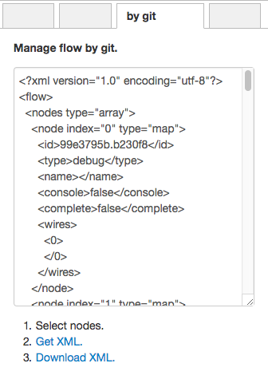

# node-red-contrib-manage-flow-by-git

## Released

|Date|Version|Description|
|:--:|:--:|:--|
|2017-09-23|0.0.1|Released|

## Feature

- Manage flow by git.
- It is easy to watch **diff** of `function node` and `template node`.
- Export XML. Push XML to git.
- JSON for restoration is also included in XML.
  - Be careful with handling due to its own processing.

## Install

- npm install --save node-red-contrib-manage-flow-by-git

## Usage

- Open "by git" tab.
  1. Select nodes.
  1. Get XML.
  1. Download XML.

## Warning

- `<json></json>` contains JSON that can be imported with Node - RED.
- However, It can not be guaranteed. 
- Please check it yourself.

## Screenshots

- Tab

- Node (do nothing)

